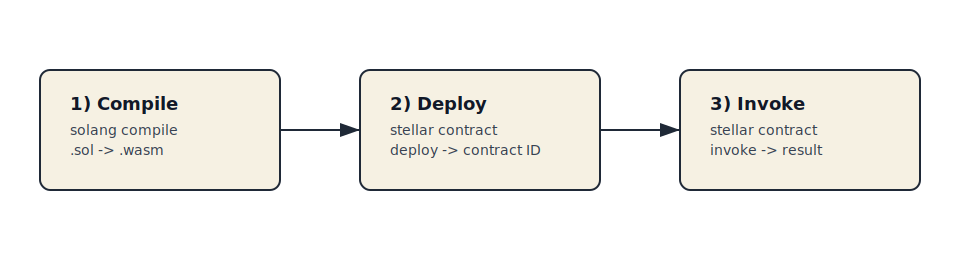
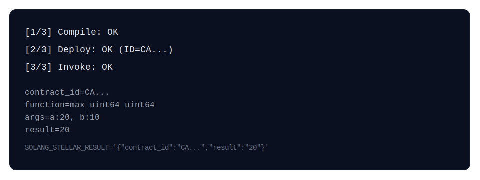

# Solang‑Stellar Test Tool 🚀

A tiny CLI wrapper that compiles a Solidity contract with Solang, deploys it to Soroban, and invokes a function — all in one command.



## Why this exists ✨
- No more copy/pasting contract IDs between steps
- Fast local iteration for Solang‑generated WASM
- Human‑readable output plus a machine‑readable summary line

## Quick start ⚡
1. Make sure you have these installed and in `PATH`:
   - `solang`
   - `stellar`
2. Generate a Stellar key if you don't already have one:
   - `stellar keys generate <name>`
3. Optional: set `STELLAR_ACCOUNT` to pick a specific key. If unset, the Stellar CLI default key is used.
4. Run the tool from this repo:

```bash
./solang-stellar test \
  --file math.sol \
  --function max_uint64_uint64 \
  --arg a=20 \
  --arg b=10
```

Example output:



## What it does 🧠
1. **Compile** Solidity to WASM using Solang
2. **Deploy** the WASM with Stellar CLI
3. **Invoke** your function and print results

## Command reference 🛠️
```
solang-stellar test [options]

Options:
  --file <path>               Solidity source file (default: inferred if only one *.sol in cwd)
  --function <name>           Function to invoke (required)
  --contract <name>           Forward to `solang compile --contract`
  --output <dir>              Forward to `solang compile --output`
  --emit <kind>               Forward to `solang compile --emit`
  --strict-soroban-types      Forward to `solang compile --strict-soroban-types`
  -O <level>                  Forward to `solang compile -O <none|less|default|aggressive>`
  --wasm-opt <level>          Forward to `solang compile --wasm-opt`
  --release                   Forward to `solang compile --release`
  --solang-target <name>      Forward to `solang compile --target <name>` (default: soroban)
  --wasm <path>               Override inferred wasm path for deploy
  --network <name>            Stellar network profile (default: testnet)
  --arg <name=value>          Function argument (repeatable)
  --<argname> <value>         Function argument passthrough (repeatable)
  --send <default|no|yes>     Forward to `stellar contract invoke --send`
  --verbose                   Print exact commands and full deploy/invoke output
  --help                      Show this help
```

## Important notes 🧩
- **Stellar key**: Generate a key before using the tool. Set `STELLAR_ACCOUNT` to choose a specific key.
- **Soroban target**: Defaults to `soroban`. Override with `--solang-target` or `SOLANG_TARGET`.
- **Function name mangling**: Overloaded functions get type‑suffixed names. Example:
  - `max(uint64,uint64)` becomes `max_uint64_uint64`
  - `max(uint64,uint64,uint64)` becomes `max_uint64_uint64_uint64`
- **Array arguments**: Always quote arrays to avoid shell globbing:
  - `--arr "[1,2]"`

## Output format 📦
The final line is machine‑readable, useful in scripts/CI:

```
SOLANG_STELLAR_RESULT='{"contract_id":"CA...","result":"20"}'
```

## Troubleshooting 🧯
- **"unrecognized subcommand"**
  - Your function name is probably mangled with types. Use the type‑suffixed version.

- **"Multiple .wasm files found"**
  - Use `--contract` or `--wasm` to be explicit.
